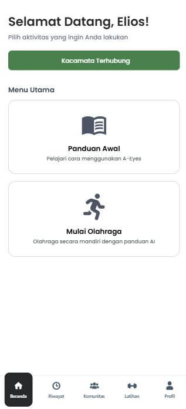
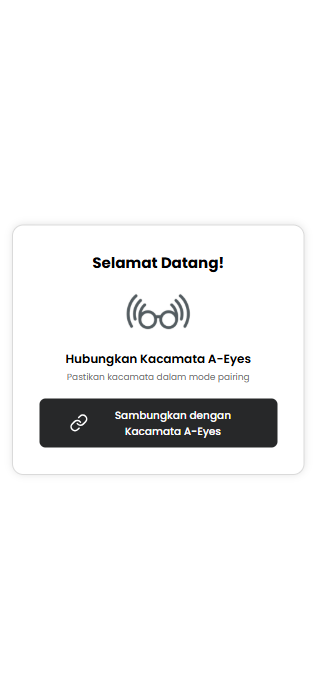
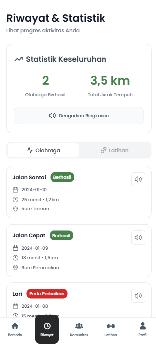

<div align="center">
  <h1>A-Eyes</h1>
  <h3>IoT Accessibility Application</h3>
  <p><em>This project was developed for <strong>Final Project – Samsung Solve for Tomorrow</strong></em></p>
  <p>
    
    
    
    
    
    
    
  </p>
  
</div>


##  Description
**A-Eyes** is an **IoT-based assistive application** designed to connect with smart glasses powered by **Raspberry Pi 2W**.  
It enables accessibility features through **real-time IoT integration**, using **MQTT (HiveMQ)** as the communication protocol between the device, backend, and frontend.  

This project aims to provide support for navigation, exercise assistance, and community engagement, particularly for accessibility purposes.  


##  Key Features

- **IoT Device Integration** → Seamless connection with A-Eyes smart glasses.  
- **MQTT Communication** → Reliable backend-device communication using HiveMQ broker.  
- **Cross-Platform Frontend** → Built with Expo (React Native) and Next.js.  
- **Backend Processing** → Real-time image processing and MQTT subscriber services.  
- **Accessible UI** → Optimized for usability and accessibility with modern design.  

## Project Structure
```
application/
│
├── app/                # Frontend (Expo + Next.js)
│ ├── (auth)            # Authentication pages
│ ├── (exec)            # Execution flows
│ ├── (flow)            # Exercise & training flows
│ ├── (tabs)            # Tab navigation pages
│ ├── assets/           # Assets (icons, images, fonts)
│ ├── components/       # Reusable UI components
│ ├── constants/        # Constant values
│ └── lib/              # Utility functions
│
├── backend/            # Backend services
│ ├── logs/             # Combined & error logs
│ └── services/         # Core backend services
│ ├── a.js
│ ├── logger.js
│ └── subscriber_pc.py  # Python MQTT subscriber
│
├── storage/            # Data storage
│ ├── images/           # Input images
│ └── results/          # Processed results
│
├── utils/              # Utilities
├── image_processor.js # Image processing script
├── index.js          # Node.js backend entry
├── .env              # Environment variables
└── README.md           # Main Project Documentation
```

## Screenshots

<div align="center">
  <table>
    <tr>
      <td align="center">
        
        <br><b>Splash Screen</b>
      </td>
      <td align="center">
        
        <br><b>Mulai Olahraga</b>
      </td>
      <td align="center">
        
        <br><b>Riwayat</b>
      </td>
    </tr>
  </table>
</div>


## Requirements


To run this project locally, ensure you have installed:  
- Node.js (v18 or later)  
- npm or yarn  
- Python 3.8+  
- Expo CLI  

**Tech Stack**:  
- **Frontend** → Expo (React Native), Next.js, Tailwind CSS  
- **Backend** → Node.js, Python  
- **IoT Device** → Raspberry Pi 2W  
- **Communication** → MQTT (HiveMQ broker)  


## How to Run
1. Clone the repository and open the project folder:
   ```
    git clone https://github.com/adndax/A-Eyes
    cd A-Eyes
   ```
2. Install dependencies
   ```
    npm install
   ```
3. Run Services
   ```
    cd application
    npx expo start
    cd ..
    python3 backend/services/subscriber_pc.py
    node backend/image_processor.js

   ```
Alternative (root)
   ```
    npm run dev
   ```
The app will run on **http://localhost:8081** or you can open it on your mobile device using **Expo Go** by scanning the provided QR code.  

## Authors
<table>
  <tr>
    <td align="center">
      <a href="https://github.com/adndax">
        <br />
        <span><b>Adndax</b></span>
      </a>
    </td>
    <td align="center">
      <a href="https://github.com/mineraleee">
        <br />
        <span><b>Heleni Gratia</b></span>
      </a>
    </td>
    <td align="center">
      <a href="https://github.com/naylzhra">
        <br />
        <span><b>Nayla Zahra</b></span>
      </a>
    </td>
    <td align="center">
      <a href="https://github.com/rararana">
        <br />
        <span><b>Rara Rana</b></span>
      </a>
    </td>
  </tr>
</table>


<div align="center"> <strong>A-Eyes – IoT Accessibility Application</strong><br> <em>Final Project – Samsung Solve for Tomorrow</em> </div>